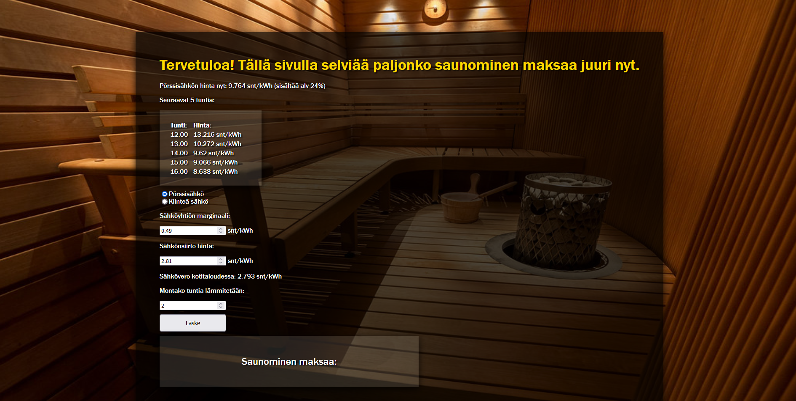

Saunawebbisivu mahdollistaa saunomisen hinnan laskemisen webbisivun-käyttöliittymässä. 

Sivu hakee viimeiset 6 pörssisähkön tuntihintaa https://sahkotin.fi/ sivuston ilmaiselta API-rajapinnalta ja niillä voidaan laskea paljonko saunominen maksaa juuri sillä hetkellä. Käyttäjä voi myös valita kiinteän hinnan jos ei käytä pörssisähköä. 

API-rajapinta on täysin ilmainen eikä vaadi rekisteröitymistä tai API-avainta.

